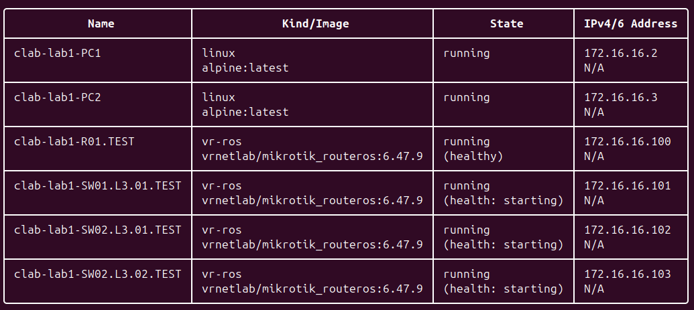

# Задание

Вам необходимо сделать трехуровневую сеть связи классического предприятия изображенную на рисунке 1 в ContainerLab. Необходимо создать все устройства указанные на схеме и соединения между ними, правила работы с СontainerLab можно изучить по ссылке.


Подсказка №1: Не забудьте создать mgmt сеть, чтобы можно было зайти на CHR<br/>
Подсказка №2 Для mgmt_ipv4 не выбирайте первый и последний адрес в выделенной сети, ходить на CHR можно используя SSH и Telnet (admin/admin)

- Помимо этого вам необходимо настроить IP адреса на интерфейсах и 2 VLAN-a для PC1 и PC2, номера VLAN-ов вы вольны выбрать самостоятельно.
- Также вам необходимо создать 2 DHCP сервера на центральном роутере в ранее созданных VLAN-ах для раздачи IP адресов в них. PC1 и PC2 должны получить по 1 IP адресу из своих подсетей.
- Настроить имена устройств, сменить логины и пароли.

# Схема

В draw.io была нарисована схема сети.


# Установка ContainerLab

ContainerLab был скачен на VM, также был скачен Docker, а в настройках виртуальной машины включить вложенную виртуализацию, так как роутеры микротик работают через виртуализацию.

Были установлены вспомогательные инструменты make и [vrnetlab](https://github.com/srl-labs/vrnetlab#). 

В папке /vrnetlab/mikrotik/routeros был скачан файл [chr-6.47.9.vmdk](https://download.mikrotik.com/routeros/6.47.9/chr-6.47.9.vmdk) и собран docker образ.

ContainerLab был установлен следующей командой:

```bash -c "$(curl -sL https://get.containerlab.dev)"```

# Базовая топология

Первым делом создали самый простой yaml файл с базовой топологией:


Командой `clab deploy -t lab1.clab.yaml` производится деплой.



А командой `clab graph -t lab1.clab.yaml` строится граф топологии.


# Добавление сети управления

Чтобы управлять устройствами, нужно создать mgmt, которому задаётся имя сети и диапазон айпи-адресов. Затем всем устройствам прописывается их айпи в этой сети.


Пока что айпи компьютерам раздадим вручную, позже - с помощью DHCP.

Командой `clab redeploy -c` производится редеплой.


Сеть позволяет по заданным айпи-адресам зайти в конфигурацию устройств по ssh.


А в компьютеры можно зайти командой `docker exec -it <имя нода> sh`.

# Конфиги 

Со всеми конфигурациями можно ознакомиться в папке config.

Для настройки корректного соответствия интерфейсов в конфигурационных файлах важно учитывать следующее: физический порт `ether1` в системе сопоставляется с логическим интерфейсом `eth0`. Поэтому при описании подключений в YAML-файлах нумерацию интерфейсов следует начинать с `ether2`, который будет соответствовать `eth1`.

## Роутер R01

На роутере ставятся 2 dhcp сервера, по которому раздаются айпишки для vlan10 и vlan20.

Для этого указываются:

1. /interface vlan
2. /ip address (для обоих вланов по адресу, задаю 10.x0.0.1/24)
3. /ip pool (прописывается ranges, начинаю с 10.x0.0.10, до этого адреса резервирую для айпи роутеров/свитчей, как например выше строчкой)
4. /ip dhcp-server (указывается пул и интерфейс влана)
5. /ip dhcp-server network (gateway=адрес R01)

## Свитч SW01

В этом свитче соединяются две сети, одна заточена на vlan 10, вторая - vlan 20. Чтобы фильтровать пакеты нужно использовать мост(bridge)

1. /interface bridge (включаем vlan-filtering для безопасности)
2. /interface vlan (указываем в interface имя моста)
3. /interface bridge port (указываем все порты устройства в интерфейсах)
4. /interface bridge vlan (указываем айди влана и в tagged сам мост и все trunk порты, связанные с данным вланом.)
5. /ip address (тут указываю для обоих interface=vlanx0 айпи адреса address=10.x0.0.2/24. Устройства выстроились в рядочек)

## Свитчи SW02

Дальше перед компьютерами стоят последние свитчи, на которых конфиги идентичны, меняются только номера вланов.

На этих свитчах тоже указывается мост, здесь нам важны его теги tagged/untagged. Если tagged нужен для trunk портов, то untagged для access портов.

1. /interface bridge
2. /interface vlan
3. /interface bridge port (у access порта надо указать port VLAN ID)
4. /interface bridge vlan (в untagged указывается access port)
5. /ip address (по традиции, 10.x0.0.3/24)

## Компьютеры

Для выполнения задания требуется настроить на компьютерах два VLAN и получить IP-адреса по DHCP. Так как на устройствах установлена Alpine Linux, конфигурацию удобно реализовать в виде bash-скрипта.

Скрипт должен выполнить следующие действия:
1. Добавить VLAN-интерфейсы командой `ip link`.
2. Запросить через `udhcpc -i` IP-адреса у DHCP-сервера для созданных интерфейсов.
3. Прописать статические маршруты командой `ip route add 10.x0.0.0/24 via 10.x0.0.1 dev vlanx0` для обеспечения сетевой связности между компьютерами.

Таким образом, компьютеры смогут взаимодействовать друг с другом внутри назначенных VLAN-сетей.

## Имена устройств и пользователи

В соответствии с заданием необходимо выполнить настройку имён устройств и заменить учётную запись администратора. Для этого на всех сетевых устройствах выполняются следующие команды:

1. Создание нового пользователя с полными правами:
   ```
   /user add name=<имя_пользователя> group=full password=<пароль>
   ```
   Группа `full` используется как группа по умолчанию с полными правами доступа, что позволяет новому пользователю заменить администратора.

2. Установка имени устройства:
   ```
   /system identity set name=<имя_устройства>
   ```

3. Удаление стандартной учётной записи `admin`:
   ```
   /user remove admin
   ```

Таким образом, будет выполнена базовая конфигурация безопасности и идентификации устройств.

Больше на админа не зайти, даже вводя корректный пароль admin:


# Результаты

## Выдача адресов

На R01 можно увидеть, какие адреса выдались компьютерам, через команду `/ip dhcp-server lease print`.


## Пинг

Пингуем с роутера другие сетевые устройства по интерфейсам вланов и компьютеры:


И демонстрируем успешную связь компьютеров, прописанную через ip route.


# Встреченные ошибки

## WSL

Изначально лабораторная работа выполнялась на Windows через WSL, работа была полностью выполнена как и сейчас, но при этом ничего не работало, долго не понимал почему, пытался разобраться, оказалось что роутеры mikrotik которые мы используем для свитчей и роутера запускаются через виртуализацию, а работая через WSL виртуализировать нельзя, в связи с чем вся лабораторная работа переносилась в виртуальную машину в VirtualBox

# Заключение

В рамках лабораторной работы была успешно развёрнута сеть, соответствующая предложенной схеме. На всех устройствах настроены IP-адреса на интерфейсах, а на компьютерах — требуемые VLAN.

Для автоматической настройки клиентов в центральном маршрутизаторе были развёрнуты и настроены два DHCP-сервера, которые обеспечили раздачу IP-адресов компьютерам в соответствующих виртуальных сетях (VLAN).

В результате была построена и протестирована трехуровневая сеть связи, имитирующая классическую корпоративную инфраструктуру. Все поставленные задачи по конфигурации и обеспечению связности выполнены.
