Группа: K3320  
Автор: Зубов Алексей Андреевич  
Лабораторная работа: Lab3

---

### Задание

Необходимо развернуть IP/MPLS сеть связи для «RogaIKopita Games», представленную на схеме, в среде ContainerLab.

Требуется:
- Создать все устройства согласно схеме и настроить соединения.
- Назначить IP-адреса интерфейсам.
- Настроить динамическую маршрутизацию OSPF и технологию MPLS.
- Настроить EoMPLS (VPLS) для связи между удалёнными узлами.
- Назначить адресацию на клиентские контейнеры, соединённые через EoMPLS.
- Настроить имена устройств и сменить стандартные учётные данные.

---

### Схема сети

Схема, разработанная в draw.io:  

Схема, отображённая в ContainerLab:  

---

### Конфигурация YAML

Структура сети аналогична предыдущим лабораторным: 6 маршрутизаторов и два клиентских устройства (компьютер и устройство SGI-PRISM, представленное как контейнер).  
Сеть управления: 172.16.16.0/24.

---

### Конфигурация устройств

#### Маршрутизаторы

После стандартной замены учётных данных выполняется следующая настройка:

1. Настройка интерфейсов и IP-адресов согласно схеме. На маршрутизаторах NY и SPB дополнительно настраиваются DHCP-серверы для клиентов.

2. Настройка OSPF:
   - Создание loopback-интерфейса (/interface bridge add name=loopback), который используется как стабильная точка для router-id.
   - Создание экземпляра OSPF с указанием router-id (адрес loopback-интерфейса).
   - Определение одной зоны (area) для всей сети (например, 0.0.0.0).
   - Добавление сетей физических интерфейсов в OSPF.

3. Настройка MPLS:
   - Включение LDP с использованием адреса loopback-интерфейса в качестве transport-address и lsr-id.
   - (Опционально) Настройка фильтров (advertise-filter / accept-filter) для контроля распространения MPLS-меток. В лабораторной работе фильтрация применена только для сетей loopback-интерфейсов.
   - Активация LDP на всех необходимых интерфейсах.

4. Настройка VPLS (EoMPLS) на маршрутизаторах NY и SPB:
   - Создание bridge-интерфейса для объединения клиентского порта и VPLS-туннеля.
   - Создание интерфейса VPLS (/interface vpls) с указанием remote-peer (адрес loopback удалённого маршрутизатора).
   - Добавление портов в bridge.

> Примечание: В документации MikroTik технологии VPLS и EoMPLS функционально схожи и используются для транспортировки Ethernet-кадров поверх MPLS.

#### Компьютеры

Клиентские устройства получают IP-адреса по DHCP командой udhcpc -i eth1.

---

### Результаты

#### 1. Работа OSPF
Маршруты успешно распределяются динамически. Статические маршруты не требуются.

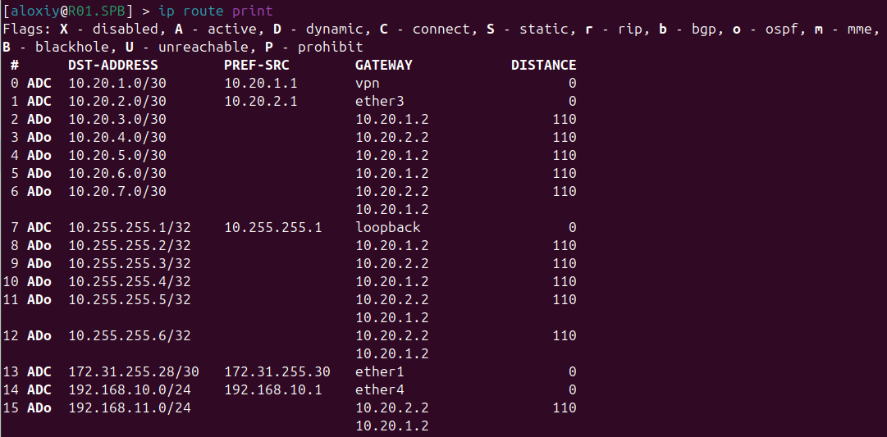
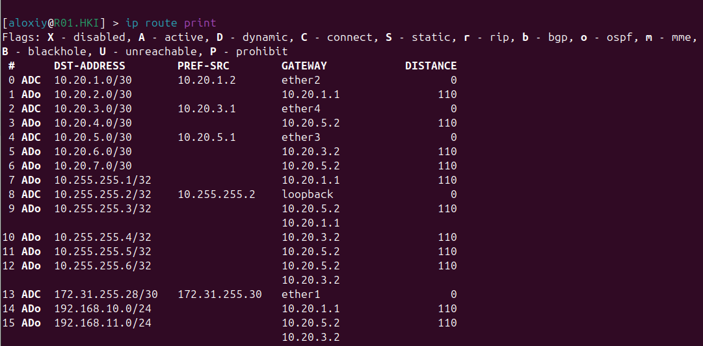
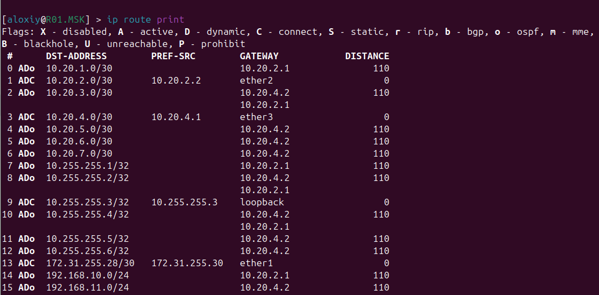
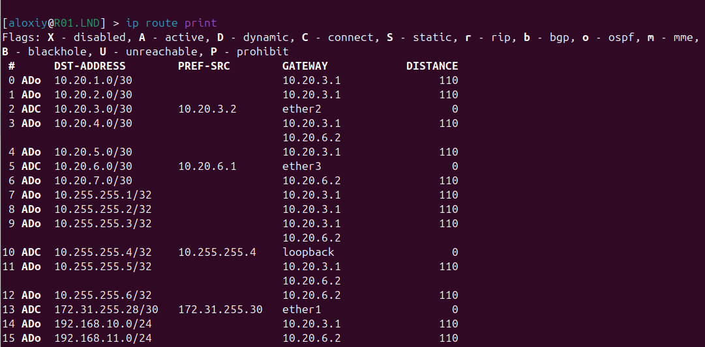
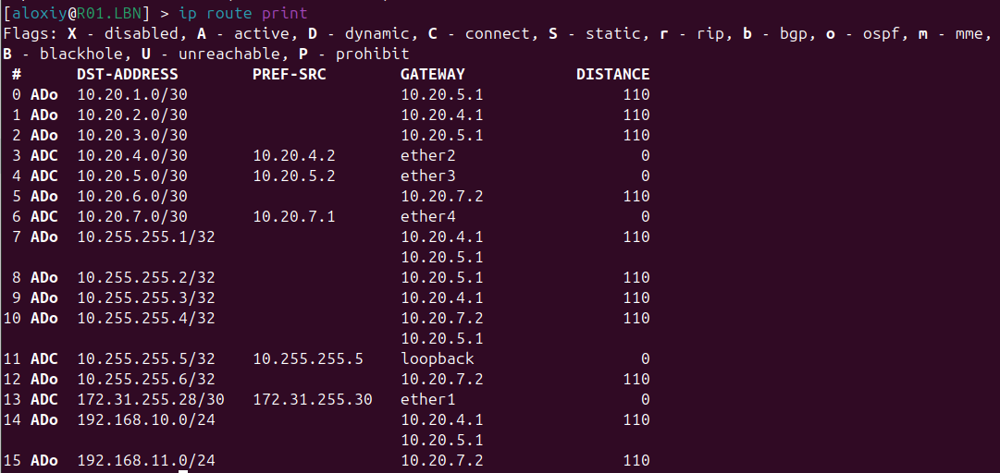
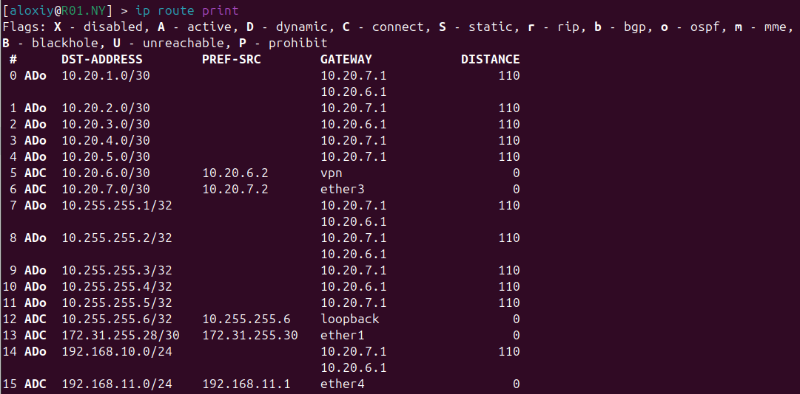

#### 2. Работа MPLS
- Без фильтрации: MPLS-метки распределяются для всех префиксов.

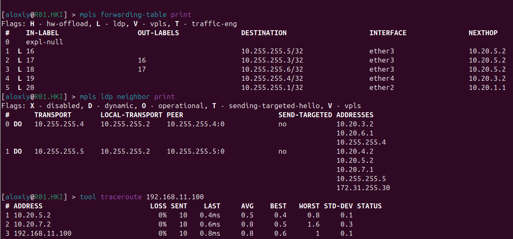
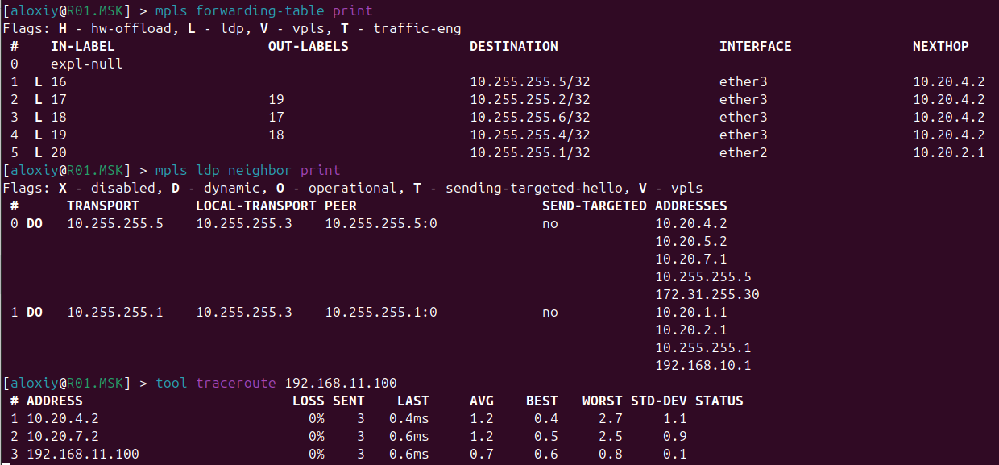
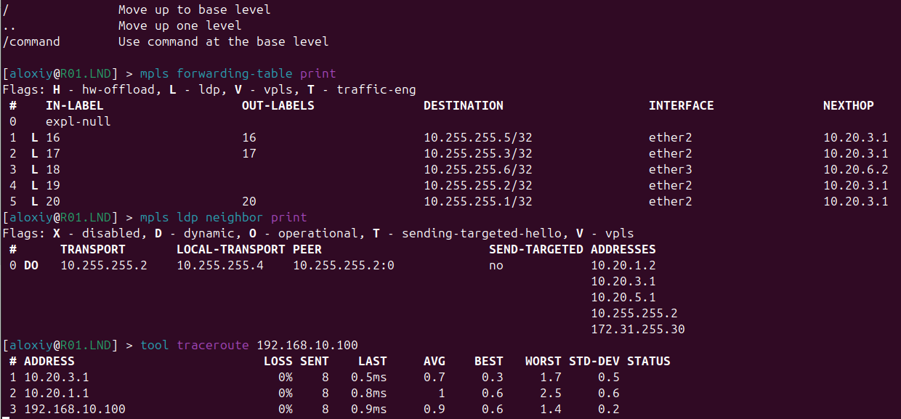
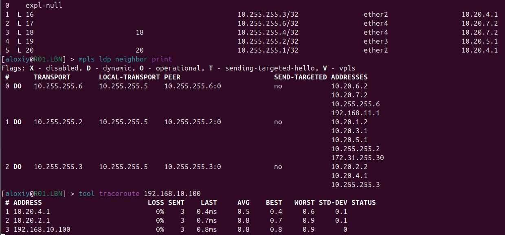
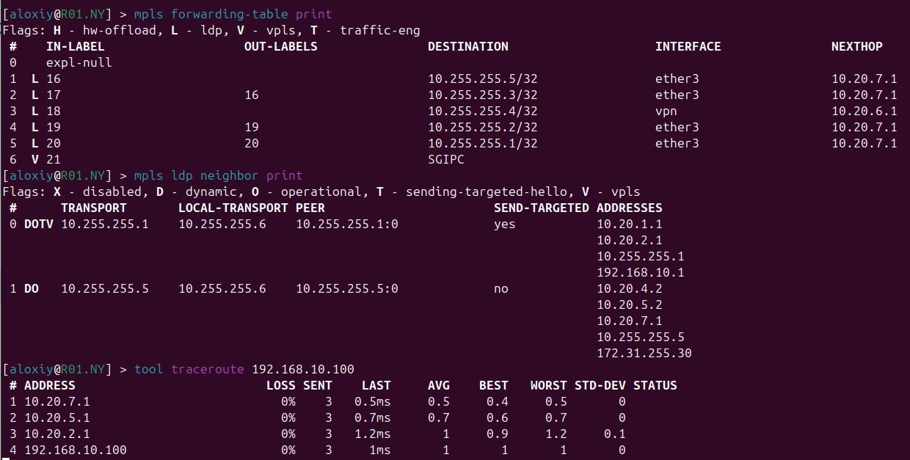

- С фильтрацией: Метки назначаются только для выбранных сетей (например, loopback-интерфейсов).
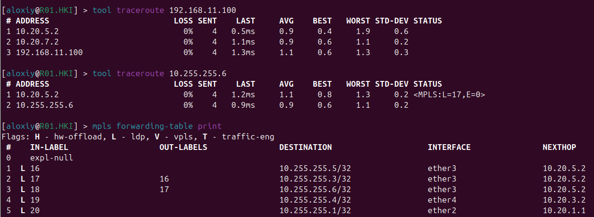

#### 3. Работа VPLS (EoMPLS)
Туннель между NY и SPB успешно создан, интерфейсы активированы.
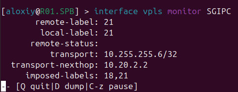
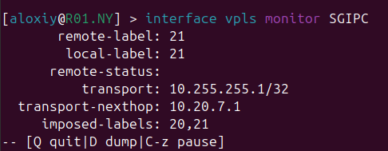
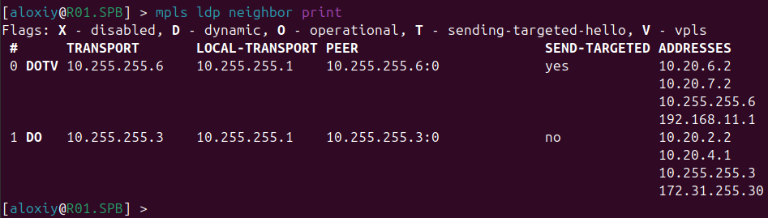
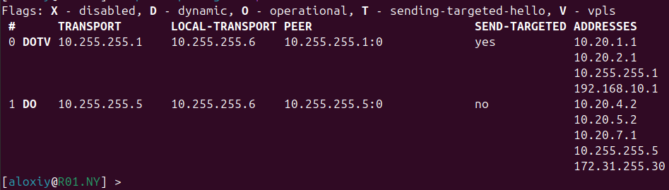

#### 4. Связность между клиентскими устройствами
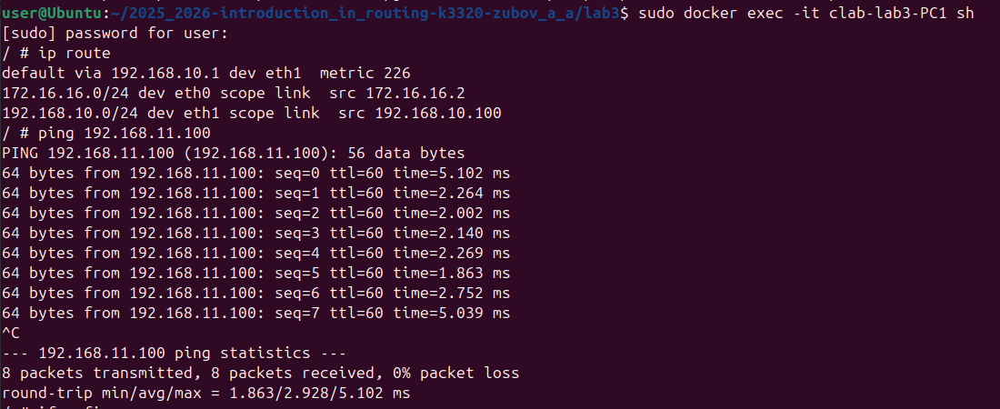

---

### Заключение

В ходе работы была успешно развёрнута IP/MPLS сеть. Настроена динамическая маршрутизация OSPF, поверх которой развёрнута инфраструктура MPLS. Для связи между удалёнными узлами NY и SPB настроен VPLS-туннель (EoMPLS).

Все устройства соединены и взаимодействуют согласно заданию. Цель лабораторной работы достигнута.
